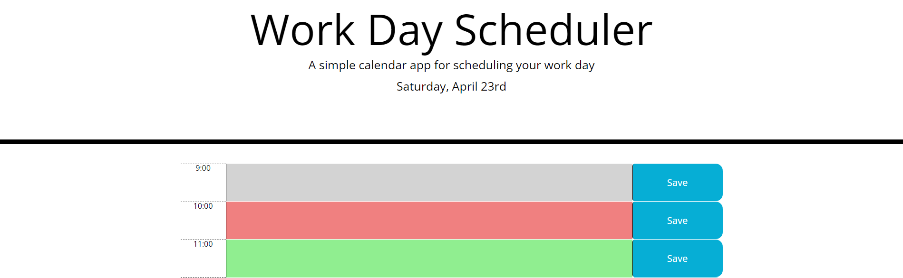

# 05-Third-Party-APIs-Homework

# Description
Create a Work Day Scheduler, that a user can input data into each hour of normal business hours, and save each entry.

# Site Preview

    

# Github Links
- Repository: https://github.com/brianalegre/05-Third-Party-APIs-Homework
- Deployed: https://brianalegre.github.io/05-Third-Party-APIs-Homework/

# Criteria
- Current Day is displayed
- Timeblocks for standard business hours
- Color code Timeblocks
- Enter text in Timeblocks
- Save text in Timeblocks
- Displays saved texts in Timeblocks
